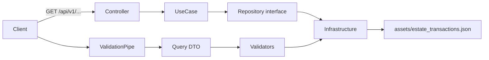

<!-- File: docs/architecture.md -->

# Architecture

## 目的

- JSON（assets/estate_transactions.json）から取引価格を検索して返すAPIを提供する
- Controller > UseCase > Repository(抽象) > Infrastructure で責務分離する

## 構造

- presentation: Controller/DTO/Validator（HTTP入出力とバリデーション）
- usecase: ユースケース（業務処理の起点）
- domain: 型・Repository抽象・DIトークン・仕様固定の制約
- infrastructure: JSON読み込みと検索（データアクセス）

## 図

## リクエストの流れ

- 200: バリデーション通過 → UseCase → Repository → JSON検索 → payload返却
- 400: バリデーション失敗（仕様/データセットに合わない）
- 404: バリデーション通過だが該当レコードなし（UseCaseでNotFound）

## 検証

- まとめて実行: `npm run verify`
- Postman: `postman/estate-transactions.postman_collection.json` をImportしてSend