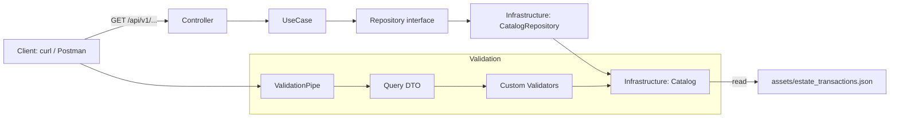
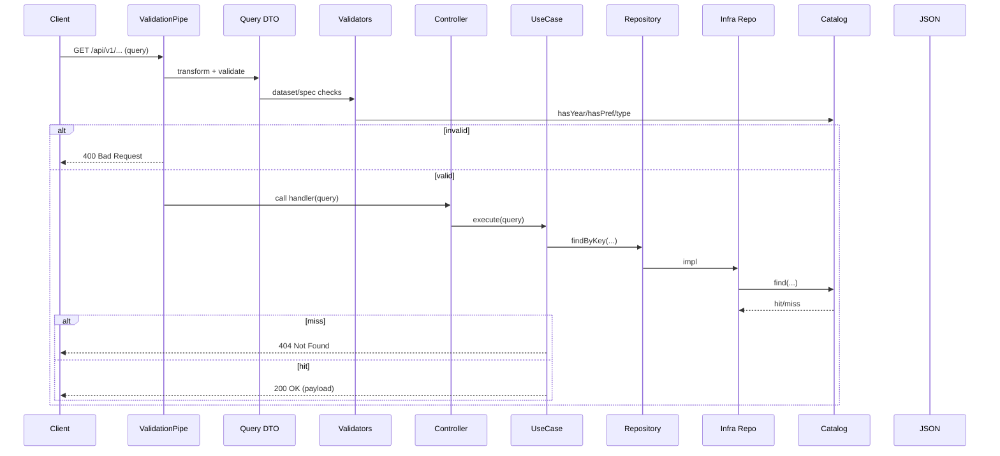
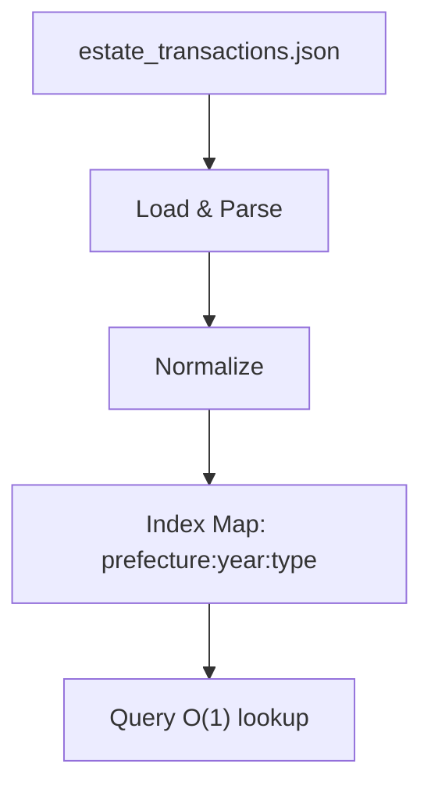

<!-- File: docs/architecture.md -->
# Architecture

このリポジトリは、不動産取引価格を検索して返すAPIをNestJSで提供する

目的は以下
- ```GET /api/v1/townPlanning/estateTransaction/bar``` を提供する
- ```assets/estate_transactions.json``` を参照し、取引価格（円/㎡）を返す
- Controllerにロジックを置かず、Controller > UseCase > Repository(抽象) > Infrastructureで責務分離する
- クエリはバリデーションし、HTTPステータスで機械的に判定できる状態にする

---

## Diagrams

### Component Diagram



### Sequence Diagram



### Data Flow



---

## High Level

リクエストの流れ

1. Client（curl / Postman）がHTTPリクエストを送る
2. NestJSが ```api/v1``` のprefixを付与したルーティングでControllerへ到達させる
3. ControllerがQuery DTOでバリデーション済みの入力を受け取る
4. ControllerはUseCaseを呼ぶ（Controllerにビジネスロジックは置かない）
5. UseCaseはRepository抽象を通じてデータ取得する
6. Repository実装（Infrastructure）がJSON由来のCatalogに問い合わせて結果を取得する
7. 結果をHTTPレスポンスとして返す（成功200 / バリデーション400 / 該当なし404）

---

## Modules / Directory Structure

対象モジュールのルート

```src/modules/town-planning/estate-transaction```

この配下を以下の責務で分割する

- ```presentation/```
  - HTTP入出力（Controller / DTO / Validator）
  - ValidationPipe + class-validatorにより入力を機械的に判定する
- ```usecase/```
  - ユースケース（アプリケーション層）
  - 例: 取引価格取得（GetEstateTransactionUseCase）
- ```domain/```
  - 型定義、Repository抽象、DIトークン、仕様固定の制約（Single Source of Truth）
- ```infrastructure/```
  - 永続化の実装
  - JSON読み込み・索引化など、データアクセスに関わる処理を担当する

---

## Responsibility Boundaries

### presentation（Controller / DTO / Validator）

- ControllerはUseCaseを呼ぶだけにする
- Query DTOでパラメータを受け取る
- Validatorは「仕様固定の制約」と「データセット由来の制約」を両方チェックする
  - 例: yearがレンジ内であること + データセットに存在すること
- 400を返す責務はValidationPipe側（入力の契約違反）

主なファイル
- ```presentation/estate-transaction.controller.ts```
- ```presentation/dto/get-estate-transaction.query.ts```
- ```presentation/validators/*```

### usecase

- 入力（ドメイン型）を受け取り、Repository抽象に問い合わせる
- 該当なしなら404（NotFoundException）を投げる
- ControllerやInfrastructureには依存しない

主なファイル
- ```usecase/get-estate-transaction.usecase.ts```

### domain

- 仕様固定の制約値、型、Repository抽象、DIトークンをここに置く
- データ差し替えで変動する値（「データセットに存在する年」等）は置かない
- 仕様固定の例
  - 年の入力レンジ（SPEC_YEAR_MIN/MAX）
  - typeの許可（SPEC_ESTATE_TYPES）
  - 関東制約の許可コード（SPEC_PREFECTURE_CODES_KANTO）

主なファイル
- ```domain/constraints.ts```
- ```domain/estate-transaction.types.ts```
- ```domain/estate-transaction.repository.ts```
- ```domain/tokens.ts```

### infrastructure

- JSONを読み込み、検索用に索引化する
- データセット由来の制約（存在する年、都道府県コード、type）を起動時に収集する
- JSONのパスは環境変数で差し替え可能にする（汎用性を確保）

主なファイル
- ```infrastructure/estate-transaction.catalog.ts```
- ```infrastructure/estate-transaction.catalog.repository.ts```

---

## Data Access Strategy

### Data Source

- ```assets/estate_transactions.json```

### Loading

- ```EstateTransactionCatalog``` が起動時（OnModuleInit）にJSONを読み込む
- 読み込みパス
  - 環境変数 ```ESTATE_TRANSACTIONS_JSON_PATH``` があればそれを優先
  - 無ければ ```assets/estate_transactions.json``` を参照

### Indexing

- ```prefectureCode:year:type``` のキーで ```Map``` を構築する
- これにより検索はO(1)

### Validation with Dataset

- Catalogが ```years/prefectureCodes/types``` を ```Set``` として保持する
- ValidatorがCatalogに問い合わせ、データセットに存在する値のみ通す

---

## API Contract

### Endpoint

- ```GET /api/v1/townPlanning/estateTransaction/bar```

### Query

- ```year```（必須、数値）
- ```prefectureCode```（必須、数値）
- ```type```（必須、数値）

### Response (200)

例

```json
{
  "year": 2015,
  "prefectureCode": 13,
  "prefectureName": "東京都",
  "type": 1,
  "value": 324740
}
```

### Errors

- 400 Bad Request
  - 入力が仕様/データセットの制約を満たさない
- 404 Not Found
  - 入力は妥当だが、該当レコードが存在しない

---

## Global App Settings

```src/main.ts``` の設定

- ```app.setGlobalPrefix('api/v1')```
- ```useContainer(..., { fallbackOnErrors: true })```
  - class-validatorのカスタムバリデータでDIを使うため
- ValidationPipe
  - ```transform: true```
  - ```whitelist: true```
  - ```forbidNonWhitelisted: true```

---

## Testing Strategy

### Unit Test

- UseCase単体を対象にする
- RepositoryはDIトークンでモック差し替えする

例
- ```src/modules/.../usecase/get-estate-transaction.usecase.spec.ts```

### E2E Test

- HTTPレイヤで 200/400/404 を担保する
- 404はRepository差し替えにより強制的に作る（データが完全に揃っている場合でも確実に検証できる）

配置
- ```test/e2e/*.e2e-spec.ts```

実行
- ```npm run test:e2e```

---

## Verification

一括確認

- ```npm run verify```
  - format
  - lint
  - typecheck
  - unit
  - e2e

---

## Postman

- ```postman/estate-transactions.postman_collection.json```
- 200/400の代表ケースを再現できる

---

## Notes

- データ不整合（例: typeが1/2以外）は起動時に例外で検知する方針
- 「仕様固定」と「データ由来」を分離し、データ差し替えに強い構造を維持する